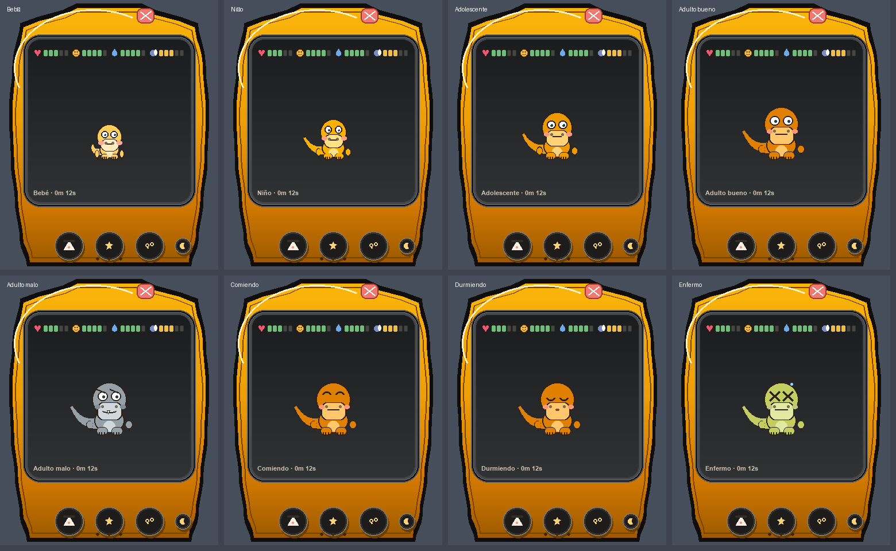

# Tamagotchi Desktop (estilo Digivice)

Tamagotchi virtual con mascota dinosaurio estilo **Agumon**, dibujada 100% con
PIL (sin assets externos), dentro de un aparato estilo Digivice en una ventana
sin bordes y transparente.

## ⬇️ Descargar y ejecutar (sin instalar nada)

**[Descarga el .exe desde Releases](https://github.com/Nando2392/tamagotchi-desktop/releases/latest)**
y haz doble clic. Funciona en Windows 10/11 sin Python ni dependencias.

> El .exe se compila automáticamente con GitHub Actions al publicar una versión
> (tag `v*`); también puedes lanzar el build a mano desde la pestaña Actions →
> *build-exe* → *Run workflow*.

## Características

- **Evolución**: huevo → bebé → niño → adolescente → adulto
- **Necesidades**: hambre, felicidad y energía (duerme de noche)
- **Estados animados**: comer, dormir (zzz), enfermo, feliz, pestañeo
- **Mascota frontal estilo Agumon**: dos ojos, hocico con boca y dientes,
  bracitos T-rex, patas con dedos, cola gruesa; sin espinas
- **Aparato estilo Digivice**: óvalo dorado con contorno negro, LCD oscuro,
  botones y botón de cerrar dentro del caparazón
- Ventana sin bordes, arrastrable, con esquinas redondeadas

## Estructura

| Archivo | Rol |
|---|---|
| `tamagotchi_art.py` | Todo el arte en PIL (caparazón, mascota, UI) |
| `tamagotchi_core.py` | Lógica del pet (estados, evolución, muerte) |
| `tamagotchi_app.py` | Ventana Tkinter + animación |
| `test_core.py` / `test_ui.py` / `test_live.py` | Tests (headless, UI y E2E) |

## Requisitos

- Python 3.11+
- Pillow

## Ejecutar

```bash
python tamagotchi_app.py
```

## Tests

```bash
python test_core.py && python test_ui.py && python test_live.py
```

## Build del .exe

```bash
pyinstaller --noconfirm --clean TamagotchiDesktop.spec
```

## Vista previa


